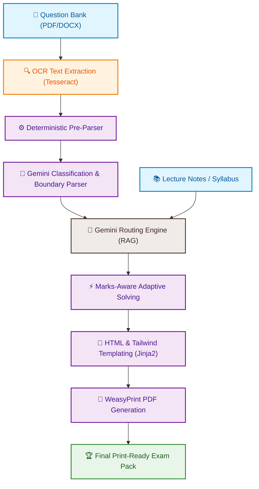

<p align="center">
  
</p>

<h1 align="center">Exam Slayer V2</h1>

<p align="center">
  <b>The ultimate AI-powered university exam preparation engine. Solve past papers, summarize slides, and build custom exam-ready PDF study guides in seconds.</b>
</p>

<p align="center">
  
  
  
  
  
  
  
</p>

<p align="center">
  <a href="https://manoj-v-exam-slayer-v2.hf.space"><b>🌐 Live App Demo</b></a> |
  <a href="#-features"><b>✨ Features</b></a> |
  <a href="#%EF%B8%8F-architecture-flow"><b>🏗️ Architecture</b></a> |
  <a href="#-local-installation--setup"><b>💻 Installation</b></a>
</p>

---

## 🌟 Why Exam Slayer V2?

University exam preparation is historically inefficient. Students waste valuable study hours:
* 📉 **Sifting through cluttered folders** of old question papers and past tests (PYQs).
* 📑 **Searching scattered lecture notes**, presentation slides, and long transcripts.
* ✍️ **Wasting hours formatting answers** to fit strict grading constraints (2/5/10 marks).

**Exam Slayer V2** automates the entire ingestion, parsing, solving, and PDF compilation workflow, turning messy exam materials into beautifully formatted, print-ready study packs in under a minute.

---

## 📦 Dual Preparation Modes

Exam Slayer V2 operates in two production-ready compiler pathways to fit different stages of revision:

<table>
  <tr>
    <td width="50%" valign="top">
      <h3 align="center">📚 Study Guide Pack Mode</h3>
      <p align="center"><i>Best for notes-only conceptual synthesis.</i></p>
      <hr>
      <ul>
        <li>💡 <b>Intuitive Conceptual Summaries</b>: Condenses dense textbooks into readable chapters.</li>
        <li>🧠 <b>Academic Mnemonics</b>: Automatically designs memory aids and tricks.</li>
        <li>🔮 <b>Predictive Exam Questions</b>: Generates predicted questions for 2, 5, and 10 marks.</li>
        <li>⚠️ <b>Common Pitfalls</b>: Highlights frequent mistakes students make on these topics.</li>
      </ul>
    </td>
    <td width="50%" valign="top">
      <h3 align="center">🧠 Solved Answer Pack Mode</h3>
      <p align="center"><i>Best for notes + past exam papers.</i></p>
      <hr>
      <ul>
        <li>🎯 <b>Targeted Question Solving</b>: Solves your exact test paper based on local notes.</li>
        <li>📏 <b>Marks-Aware Brevity</b>: Automatically structures answers based on marks weight.</li>
        <li>📖 <b>Integrated Code & Formulas</b>: Formats mathematics and source code logic cleanly.</li>
        <li>✅ <b>Hallucination Prevention</b>: Grounds answers inside your provided course context.</li>
      </ul>
    </td>
  </tr>
</table>

---

## ✨ Features

- **Hybrid Question Parsing**: Uses structural algorithms (regex, typography) coupled with Google Gemini AI to accurately segment question bounds in unstructured documents.
- **Context-Aided RAG Architecture**: Direct grounding in uploaded study guides to guarantee answers align with course-specific syllabi.
- **Dynamic Answer Batching**: Orchestrates segmented API queries to solve large question papers completely without running into model context windows or token limits.
- **Advanced OCR Support**: Integrated with `Tesseract OCR` to extract clean text from scanned exam papers and handwriting.
- **Multi-Model Fallback Routing**: Auto-routing between Gemini models to maintain low latency and high availability.
- **Paged PDF Engine**: Utilizes `WeasyPrint` with Paged CSS rules to export gorgeous paginated booklets with customized cover badges, page breaks, and margin notes.
- **Modern Responsive GUI**: Sleek React dashboard featuring radial glow aesthetics, theme switching, and real-time step trackers.

---

## 🏗️ Architecture Flow

The following interactive diagram shows how text inputs are ingested, processed, solved, and exported:



---

## 🛠️ Technical Stack

| Layer | Technologies |
| --- | --- |
| **Frontend** |    |
| **Backend** |   |
| **AI Core** |  |
| **OCR & PDF** |   |
| **Infra** |   |

---

## 📸 App Preview

<p align="center">
  
  &nbsp;
  
</p>

---

## 🚀 Live Demo

Interact with the production system deployed on Hugging Face Spaces:

🔗 **[https://manoj-v-exam-slayer-v2.hf.space](https://manoj-v-exam-slayer-v2.hf.space)**

---

## 💻 Local Installation & Setup

### Prerequisites
1. **Python 3.11+** & **Node.js 18+**
2. **Tesseract OCR**: Install via package manager (`brew install tesseract` on macOS, `sudo apt install tesseract-ocr` on Ubuntu, or installer on Windows).
3. **GTK/Pango/Cairo**: Required by WeasyPrint for compiling CSS paged media. Follow [WeasyPrint installation guides](https://doc.courtbouillon.org/weasyprint/stable/first_steps.html#installation) for your OS.

### 1. Backend Setup
```powershell
# Navigate to backend and create env
cd backend
python -m venv .venv

# Activate Virtual Env (Windows Powershell)
.\.venv\Scripts\activate

# Install requirements
pip install -r requirements.txt
```

Create a `.env` file in the `backend/` directory:
```env
GEMINI_API_KEY=your_gemini_api_key_here
TESSERACT_CMD=tesseract
DEBUG=True
FILE_RETENTION_HOURS=24
```

Start the FastAPI application server:
```powershell
uvicorn app.main:app --reload
```
Swagger UI documentation endpoints will spin up at [http://localhost:8000/docs](http://localhost:8000/docs).

---

### 2. Frontend Setup
Open another terminal:
```powershell
# Navigate to frontend and install modules
cd frontend
npm install

# Start Vite dev server
npm run dev
```
Open [http://localhost:5173](http://localhost:5173) in your web browser.

---

## 🐳 Production Deployment

### Docker Container Build
Build and run the unified frontend + backend image locally:
```bash
# Build production Docker image
docker build -t exam-slayer-v2 .

# Spin up container on local port 7860
docker run -p 7860:7860 -e GEMINI_API_KEY="your_api_key" exam-slayer-v2
```

### Deploying to Hugging Face Spaces
1. Create a new **Docker Space** in Hugging Face.
2. In Space settings, register your `GEMINI_API_KEY` as a repository secret.
3. Configure the Hugging Face Git remote and push:
   ```bash
   git remote add hf https://huggingface.co/spaces/Manoj-V/Exam-Slayer-V2
   git push hf main
   ```

---

## 📖 Step-by-Step Usage

1. **Select Preparation Mode**: Choose **Study Guide Pack** or **Solved Answer Pack**.
2. **Upload Course Notes**: Add lecture notes, transcripts, or textbooks (PDF/DOCX/PPTX, up to 5 files).
3. **Ingest Exam Bank** *(Answer Pack Mode)*: Upload the past paper or test paper you want solved.
4. **Compile**: The RAG orchestrator splits papers, classifications marks, triggers queries, and structures the answer guide.
5. **Download**: Preview generated responses dynamically, and click download to fetch the paginated, print-ready PDF booklet.

---

## ⚠️ Known Constraints & Limitations

* **OCR Accuracy Dependency**: Heavily smudged scans, slanted handwriting, or degraded documents will limit OCR text quality, causing cascade parsing issues in downstream LLMs.
* **Context Coverage**: Answers are strictly grounded in uploaded files. If details are missing from course notes, the model infers answers using general logic, which may not match specific syllabus grading keys.
* **Complex Formatting Ingestion**: Complex hand-drawn circuit schematics, vector diagrams, or multi-dimensional matrices in scanned files might not translate cleanly to textual representations.

---

## 🗺️ Future Roadmap

* **⚡ Smart Domain solvers**: Incorporate specialized parsing agents for mathematical notations (LaTeX conversion) and code scripts (syntax-highlighted blocks).
* **🎨 Rich Formatting Templates**: Introduce multiple themed PDF layout templates (e.g. Minimalist, Classic Academic, Slate Dark).
* **💾 Semantic Cache Layer**: Integrate vector semantic search database to match and cache common question patterns, reducing API overhead.
* **🤝 Study Groups Sharing**: Introduce collaborative shared links to host compilations directly.

---

## 📄 License

Distributed under the MIT License. See [LICENSE](LICENSE) for more details.
